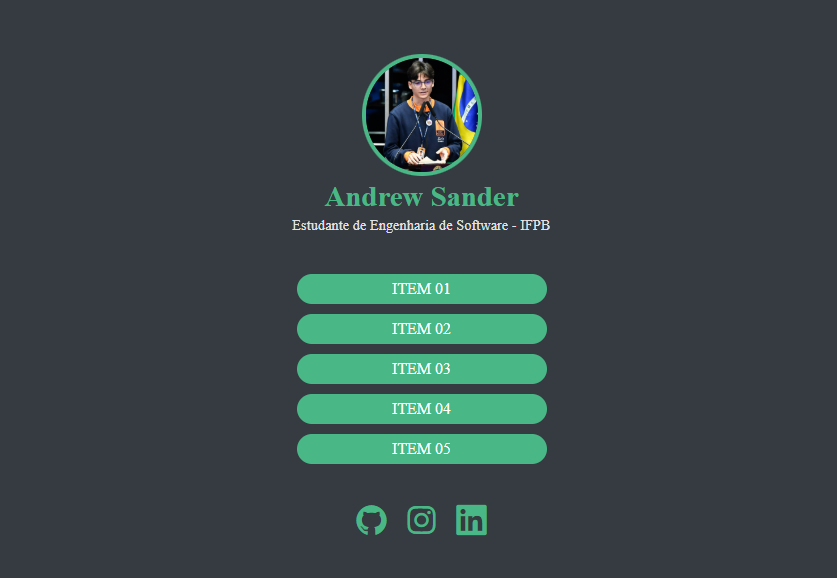

# 🧩 Projeto Linktree

## ⚙️ Sobre o Projeto

Este site é a culminância dos conceitos básicos de desenvolvimento web que eu aprendi nos últimos meses. Com uma interface simples, inspirada nos modelos de linktree e produzida apenas com **HTML** e **CSS** (até o momento), esse site irá servir para manter um acervo de links e documentos, fazendo parte do meu portfólio pessoal.

## 🚀 Tecnologias

    

## ✨ Funcionalidades

- [ x ] Header com foto, nome e breve descrição do usuário
- [ x ] Links com repositórios ou sites
- [ x ] Área destinada para as redes sociais
- [ x ] Animações suaves
- [ _ ] Design responsivo (em progresso)

## Autor

📫Contato: andrewsanderf@gmail.com

## Deploy

Acesse Aqui 👉 [Deploy do projeto](https://linktree-two-coral.vercel.app)